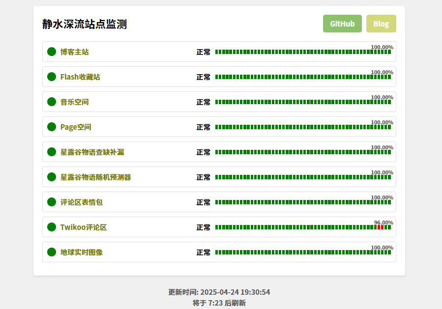

# Status监控页面

话不多说，先上效果图（页面经过缩放）

支持功能：

1. 使用Cron定时器每隔半小时自动请求目标站点，获取运行状态
2. 手动运行监测，通过访问/api/refresh?key=<你的密钥> 来手动运行一次站点监测

使用KV储存数据，KV只要不频繁的写入，一天10万次读取额度和Workers一样，够够的。

部署很简单，点击上方的一键部署，部署好后去Workers设置里修改KEY变量，修改成你想要设置的值

记得到HTML文件里修改你的显示名称、标题、logo；到Workers.js里修改你的站点URL